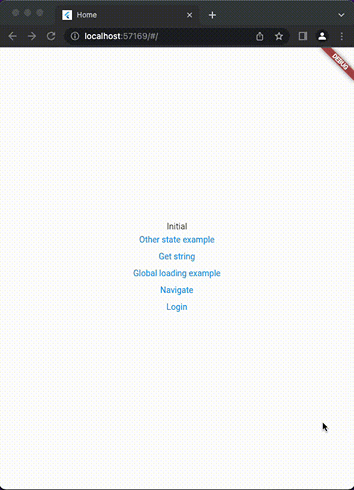
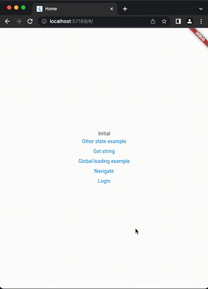

# Bottom Navigation Bar

[](https://github.com/felangel/mason)

A brick to create persistent or not-persistent bottom navigation bar. Works on mobile and web.

## Preview

Persistent and non-persistent bottom navigation bar


|Persistent                                        |Not-persistent                               |
|:-------------------------------------------: |:-----------------------------------------------:|
| ||


## Getting Started

### Requirements

 - [Beamer](https://pub.dev/packages/beamer)

### How To Use 🚀

1. In the root folder of your project run the following command (replace **my_app** with the name of **YOUR** app).

```
mason make bottom_navigation_bar --project_name my_app
```
You will get an interactive prompt where you'll specify bottom navigation bar **type**, **number of tabs** in the navigation bar and the **names** of tabs.



2. In the ***home_tabs.dart*** configure icons of your tabs.

<details open="open">
<summary>home_tabs.dart</summary>

```dart
enum HomeTabs {
  home,
  myReservations,
  myProfile,
}

extension HomeTabExtension on HomeTabs {
  static final tabImagesPath = {
    HomeTabs.home: Icons.home,
    HomeTabs.myReservations: Icons.home,
    HomeTabs.myProfile: Icons.home,
  };

  static final tabTitle = {
    HomeTabs.home: 'Home',
    HomeTabs.myReservations: 'My reservations',
    HomeTabs.myProfile: 'My profile',
  };

  static final tabRoute = {
    HomeTabs.home: HomePage.routeName,
    HomeTabs.myReservations: MyReservationsPage.routeName,
    HomeTabs.myProfile: MyProfilePage.routeName,
  };

  static final snakeCaseTitle = {
    HomeTabs.home: '/home',
    HomeTabs.myReservations: '/my_reservations',
    HomeTabs.myProfile: '/my_profile',
  };

  String getTabTitle() => tabTitle[this]!;

  String getTabRoute() => tabRoute[this]!;

  IconData getImagePath() => tabImagesPath[this]!;

  String getSnakeCaseTitle() => snakeCaseTitle[this]!;
}
```
</details>

3. In generated ***test.dart*** file you'll see commented code. Uncomment code where you can see ***if/else*** statements:

<details open="open">
<summary>Case 1: Persistent</summary>

```dart
if (routeInformation.location!.contains('home') ||
              routeInformation.location!.contains('my_reservations') ||
              routeInformation.location!.contains('my_profile')) {
            return BottomNavbarLocation(routeInformation);
          }
```
</details>

<details open="open">
<summary>Case 2: Not-Persistent</summary>

```dart
if (routeInformation.location!.contains('counter')) {
            return CounterLocation(routeInformation);
          } else if (routeInformation.location!.endsWith('home') ||
              routeInformation.location!.endsWith('my_reservations') ||
              routeInformation.location!.endsWith('my_profile')) {
            return BottomNavbarLocation(routeInformation);
          }
```
</details>

4. Paste that code inside *locationBuilder* in ***BeamerRouter***:

<details open="open">
<summary>Example</summary>

```dart
BeamerRouter(
      routerDelegate: BeamerDelegate(
        initialPath: '/',
        locationBuilder: (routeInformation, _) {
          if (routeInformation.location!.contains('home') ||
              routeInformation.location!.contains('my_reservations') ||
              routeInformation.location!.contains('my_profile')) {
            return BottomNavbarLocation(routeInformation);
          } else {
            return BeamerLocations(routeInformation);
          }
        },
      ),
      routeInformationParser: BeamerParser(),
    );
```
</details>


## Variables ✨

| Variable         | Description                      | Default      | Type    |
| :---------------:|:-------------------------------: | :---------:  | :-----: |
| `project_name`   | The name of your project         | my_app       | `string`|
| `bottom_nav_bar` | Bottom navigation bar type       | persistent   | `enum`  |
| `number_of_tabs` | Number of tabs                   |    4         | `int`   |


## Outputs 📦

<details open="open">
<summary>Structure of folders</summary>

```
├── features
    ├── bottom_navbar
        ├── bottom_navbar.dart
        ├── bottom_navbar_location.dart
        ├── home_tabs.dart
        ├── navbar_delegates.dart
        └── test.dart
    ├── home
        ├── data
            ├── models
            └── repositories
        ├── domain
            ├── entities
            └── notifiers
        ├── home_location.dart
        └── presentation
            ├── pages
                └── home_page.dart
            └── widgets
    ├── my_profile
        ├── data
            ├── models
            └── repositories
        ├── domain
            ├── entities
            └── notifiers
        ├── my_profile_location.dart
        └── presentation
            ├── pages
                └── my_profile_page.dart
            └── widgets
    └── my_reservations
        ├── data
            ├── models
            └── repositories
        ├── domain
            ├── entities
            └── notifiers
        ├── my_reservation_location.dart
        └── presentation
            ├── pages
                └── my_reservation_page.dart
            └── widgets
 ```
</details>
 
 
 
 
# Contributors ✨

<a href="https://hr.linkedin.com/in/adrijanomicevic"><br /><sub><b>Adrijan Omićević</b></sub></a>

